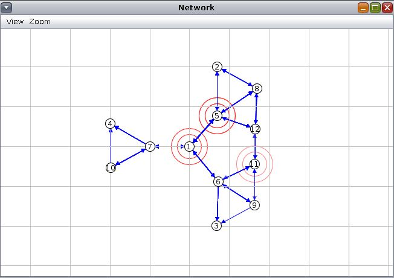

# HomeIoT

**HomeIoT** is project for smart home automation, simulating a full [**IoT**](https://en.wikipedia.org/wiki/Internet_of_things) architecture and providing an user interface to interact with it.
IoT devices (lights, motion sensors, thermometers, ...) are all interconnected in a [**IPv6**](https://en.wikipedia.org/wiki/IPv6)-based [**wireless sensor network**](https://en.wikipedia.org/wiki/Wireless_sensor_network).  

The sensor nodes (motes) are implemented in [**Contiki-OS**](http://www.contiki-os.org/) and run in the [**Cooja**](https://anrg.usc.edu/contiki/index.php/Cooja_Simulator) simulator.  
The [**CoAP**](https://en.wikipedia.org/wiki/Constrained_Application_Protocol) protocol enables communication between the motes and a cloud application running the CLI and smart services.

## Devices

Here is a list of smart devices emulated in the project:
- `bulb`: lightbulb
- `pir`: PIR (motion sensor)
- `thermo`: thermometer
- `heater`: heater
- `aircond`: air conditioner  

All the motes support the IPv6 protocol. In addition, a node acts as a border router for the whole network.

## CLI

These are the available commands and their description:
- `ls`: display the currently registered resources
- `read`: show the status of a resource or a group of them
- `set`: change the status of a resource or a group of them
- `smartlights`: get or change the status of the SmartLight service
- `smarttemp`: get or change the status of the SmartTemperature service
- `clear`: clear the console output
- `help`: display help information about a specific command

## Smart services

A couple of automated smart services are offered:
- `Smart Lights`: every time a PIR sensor detects motion, the corresponding room lightbulb is turned on.
- `Smart Temperature`: when the average temperature recorded by the thermometers is above or below certain thresholds, 
the heaters or the air conditioners are switched on accordingly.

## Issues

If you encounter any problem, feel free to open an issue. I am open to pull requests as well.

## Credits

The project was developed by Leonardo Lai. Please check the license if you are going to use, modify or share this work.
